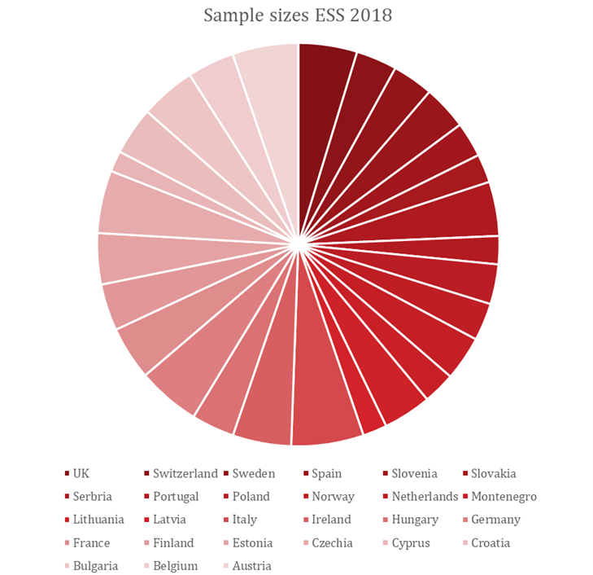
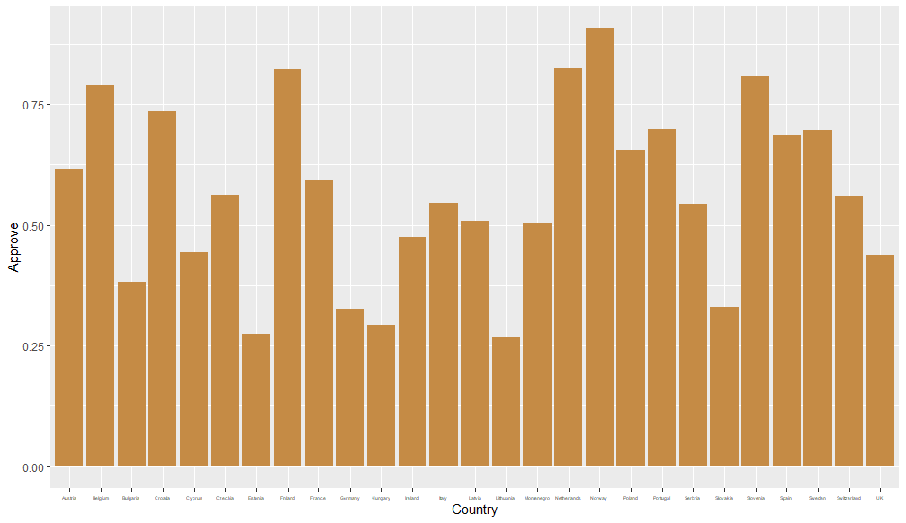
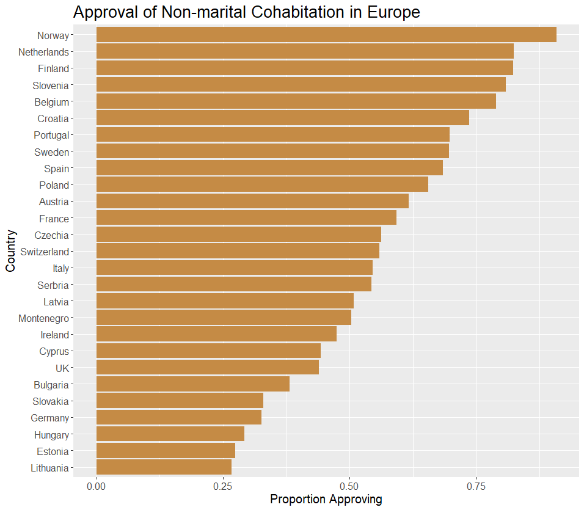
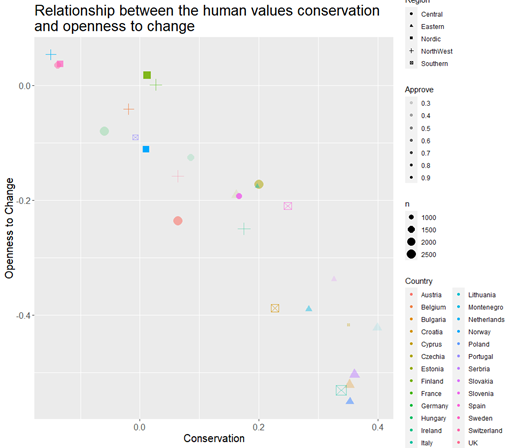
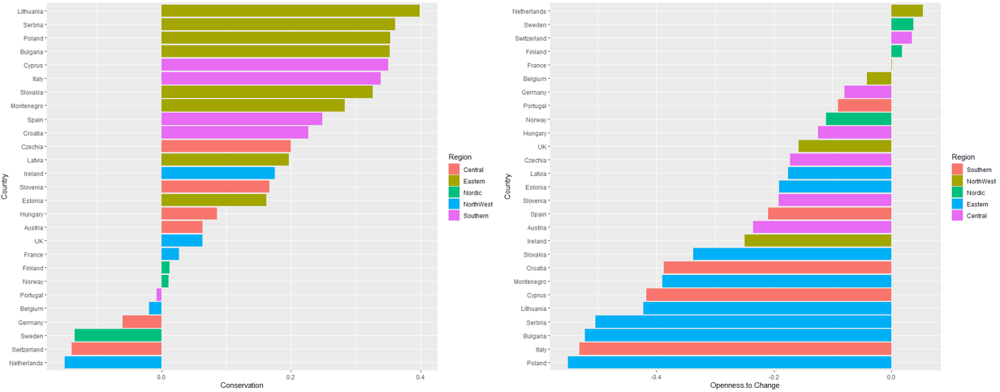

# Presenting results as tables and graphs 1 {#tablegraph1}

## DRAFT

## Video Under Construction

```{r,echo=FALSE,out.width="100%"}

```

## The importance of visualising data

Visualizing data is an essential part of communicating messages and results to any form of audience. An ineffective visualisation of data can communicate a very misleading message. 

Building skills in data visualisation can help you to understand and see important results in other people’s tables, graphs, and maps. This is in addition to enabling you to create informative visualisations of your own.

The aim of this chapter is to provide some principles behind making good data visualisations.

This guide is intended for anyone who wishes to develop their data visualisation and reporting skills. The advice presented here will be applicable to a wide variety of situations and is not specific to certain topics. Additionally, we hope that users of all ability levels will be able to take this advice to mind in their future projects and their everyday interactions with data.

[add some more points here - bullet pointed??]

## Principles of data visualisation

Through developing your data visualisation skills, you can generate a wide variety of graphical/cartographic/tabular representations of data. This could be anything from simple bar graphs and line graphs to complicated cartograms. However, regardless of the complexity of your chosen data visualisation technique, there are certain principles that should always be followed:

### Effectiveness

By effectiveness, we mean you should be ensuring that you are using the right type of visualisation for your objectives and priorities. This is the first crucial step in making sure what you produce is effective at displaying the message you intend to show. If you pick the wrong method, your visualisation will not be effective regardless of its quality. 

Maps are of course for displaying data which have some form of geographic component.

Tables are suited for presenting structured numerical information; consider tables of means across some groups, frequencies, or some statistical information. This makes them ideal for when the message is in the specific numbers and potentially the relationship between them. 
Graphs are quite multi-purpose; there is a type of graph for almost any message you could be wanting to convey. In general, we would choose to use them for indicating trends, making broad comparisons, or showing relationships.

For instance, the pie chart below is completely unnecessary. While it is looks fine, the information is not being shown well by the use of a graph, certainly not by a pie chart. This is not helped by there being far too many colours and countries. The more effective way to display this information would be a table.



### Readability

All elements of your visualisation should be legible, understandable, and coherent. In a word, readable. While this largely relates to any textual elements of your visualisations, the principle is applicable to the whole visualisation.

This includes having titles and headings which concisely explain the content. It should be informative without being overly long and confusing. The same goes for any further labels such as axis labels for graphs, column headings for tables and geographic labels on a map.

Details to consider mentioning include measurement units, geographical coverage, time, the source of the data and any relevant statistics. 
Of course, the elements of a visualisation will vary depending on what visual you produce, but they should always be easy to read and understand.

You can achieve this by avoiding language beyond the scope of your target audience, providing the necessary information needed to read your visual and presenting the element in a simple and tidy manner. You will find further guidance on specific elements in each of the subsequent sections of this guide.

The example below makes a simple error. In an attempt to stop overlapping axis labels, the text size has been reduced to be far too small. A much simpler solution would have been to swap the x and y axis over. We are also missing a title and the y axis is uninformative.





### Tidiness

A visualisation should never be cluttered. This follows on from readability, although more specifically relates to positioning and spacing of elements as well as avoiding using unnecessary elements. 

This includes making sure no elements are overlapping; there should be adequate spacing between them without there being so much that it makes the visualisation look empty. This can also be described as making good use of “white space”. 

There is much more to be said on this topic, but these are mostly specific to the type of visualisation you are using. The general principle of ensuring your visual is neat and organised is always applicable. 


### Informative

A good data visualisation serves to succinctly show a message about our findings. We aim to inform our reader. Usually, it would be accompanied by some text which helps to interpret the visualisation, placing it into a wider context or providing more formal details such as the results of a relevant statistical analysis.

However, a good data visualisation should be self-explanatory and should be able to serve as a stand-alone piece. The reader should be able to understand the message without constantly referring to the text. Much of this can be accomplished by sticking to the particulars of keeping your visual tidy and readable. 

Whenever creating a table, graph, or a map, you should include the source of the information from which the visualisation was created. This aids the credibility of your visualisation but also ensures a properly informed audience. An exception is when all information that is used for visualisations in a report comes from the same source. In this case, you should clearly indicate the source in advance of your visualisations.

This also means making sure that your visual is necessary in the first place. Consider the following: Can you achieve the same message with some simple text? Can a visualisation accurately demonstrate your results, or would it be distracting? Are your results too complex to visualise in isolation?

The example below makes an easy mistake in which by trying to provide too much information the plot actually becomes very difficult to read and therefore fairly uninformative as its difficult to learn anything from it. It is far too tasking to look at so many relationships at once so nothing is learned from this. Plus there are some difficult concepts being used with no understanding of measurement so this graph would not make sense out of context.




```{r, fig.height= 0.5, echo = FALSE}
knitr::include_graphics("img/not too much man.png",)
```

Much better


### Accessibility

Accessibility has become an increasingly important aspect of data presentation in recent years. Ensuring good practice in accessibility will help in getting an even wider audience to see our research and use our results. The Government Statistical Service makes content accessible to those with impairments to their vision, hearing, mobility, and thinking/understanding skills. For our purposes, we are mostly concerned with visual impairments. 

There are some general principles on accessibility, including making sure you explain any uncommon abbreviations, avoiding clutter and keeping information concise. However, we are focusing on the use of colour. Further guidance on this is included in the accessibility section of this document. This includes considerations of colour blindness, cultural context, and the use of saturation/hue/luminance. 

It is quite easy to forget to consider how our visualisations may appear to other people. The example below shows you just how different your visualisation may look to someone who suffers from visual impairments such as colour blindness.


### Consistency

This is mostly relevant when you are intending to use multiple visualisations across your report. When doing so, it is important to ensure you maintain a level of internal consistency. 

This involves many aspects. For instance, if you intend to disaggregate your visuals by the levels of a variable, pay attention to the order you put these categories in. They should be kept to a logical or ascending/descending order and this order should be kept the same for the sake of consistency and readability. 

The same goes for when using colours to indicate certain characteristics of the data; keep the meaning of the colours consistent. 

Of course, this is also important for all the smaller details such as the font, size and face (bold/italic) of text. In essence, try to keep the formatting between visualisations as similar as possible. Generate your personal visual style and stick to it. Changing things up too much will just confuse your audience and reduce your visual’s readability. 

The example below unnecessary changes the order of the y axis and changes the meanning of the colours. While the graphs are okay as stand alone pieces, together they diminish the effectiveness of the whole visualisation. 



## Other Resources

***General***

[Our extensive guide which also covers maps]()

[GSS – Introduction to Data visualisation](https://gss.civilservice.gov.uk/policy-store/introduction-to-data-visualisation/#section-7)

[Informative Presentation of Tables, Graphs and Statistics](https://stats4sd.org/resources/412)

[Data visualisation examples](https://stats4sd.org/resources/59)

[Tips on effective use of tables and figures in research papers](https://www.editage.com/insights/tips-on-effective-use-of-tables-and-figures-in-research-papers)

[Tufte Principles](https://sites.google.com/site/tufteondesign/home/six-fundamental-principles-of-design)

[Blog with accompanying free guide](https://blog.hubspot.com/marketing/great-data-visualization-examples)

***Tables***

[Exporting Tables from R using Flextable, Kable and gt](https://stats4sd.org/resources/506)

[Preparing tables for research papers](https://www.manuscriptedit.com/scholar-hangout/preparing-tables-research-papers/)

[Formatting Tables in MS word](http://www.docs.is.ed.ac.uk/skills/documents/3575/3575.pdf)

***Graphs***

[R Graphics Cookbook](https://r-graphics.org/)

[Financial Times – Visual Vocabulary](https://github.com/ft-interactive/chart-doctor/blob/master/visual-vocabulary/Visual-vocabulary.pdf)

***Accessibility***

[ONS – Web accessibility](https://style.ons.gov.uk/writing-for-the-web/web-accessibility/introduction-3/)

[Tableau – Colour Blindness](https://www.tableau.com/about/blog/2016/4/examining-data-viz-rules-dont-use-red-green-together-53463)

***Good Examples***

[Reddit - r/dataisbeautiful](https://www.reddit.com/r/dataisbeautiful/)

***Bad Examples***

[Reddit - r/dataisugly](https://www.reddit.com/r/dataisugly/)

[towardsdatascience.com article](https://towardsdatascience.com/why-is-this-chart-bad-5f16da298afa)
