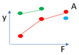

# Presenting results across multiple factors {#factor}

```{r,echo=FALSE,message=FALSE,warning=FALSE}
library(tidyverse)
library(knitr)
library(Hmisc)
```

## DRAFT

## Introduction

A common task in presenting results is how to show how an outcome variable differs across multiple explanatory factors. Often this will result from conducting a factorial treatment experiment, for example a randomised complete block design looking at whether yield varies across 5 different varieties of a crop, with 3 different levels of nitrogen fertiliser used. However the same principles are common to any analysis where we are wishing to compare the effects of multiple factors all at once, where they are designed 'treatments' or observed responses from a survey.

Whenever visualising results across multiple factors we should be thinking of ways to clearly and effectively show the impacts of all of these different factors; rather than simply highlighting 'best' or the 'worst.

In some cases, particularly considering a classic factorial experiment, the design of the trial itself provides a framework for how we should be visualising the results. In others there may be multiple options, some of which we can determine to be more effective than others,

## Video 

```{r,echo=FALSE,out.width="100%",fig.cap="https://www.youtube.com/0k-xc6YOtWc"}
knitr::include_url("https://www.youtube.com/embed/0k-xc6YOtWc")
```


## Overall principles

A key principle to bear in mind always is that there is never only one correct way to present results. But there definitely lots of incorrect or extremely ineffective ways. Even following a set of principles a certain amount of iteration and trial and error of different plot configurations will help the thought process and ensure that you are choosing a sensible and effective plot to convey your message.  Don't expect to immediately land on the 'best' answer.

What is effective depends on a few criteria:
*	The message or objectives. The same data can be presented in different ways to highlight different trends.
*	The design or structure of the data. Consider how many different variables you have, and how many response levels are in those variables, and what sort 
*	The actual observed data - this will inform scales, transformations and may lead you into presenting results in multiple different plots, or all in a single plot.
*	The intended audience - a plot for publication in a journal is unlikely to be as effective if used in a presentation for a conference. And a technical audience will look for different things, and have different expectations when looking at a plot to a more general audience.

## Example Data

The following apply to any response that is measured on experimental units, even if we usually think of a continuous variable typified by ‘yield’. We are going to use some simulated data in this document to show the process for comparing 'yield' across a factorial experiment. The design incorporates two treatment factors -  "Type" (A, B or C) and "Inputs" (0, 100 or 200). There were 20 farmers who all included the 9 treatment combinations. The 20 farmers are split across 3 sites (X, Y and Z) and we may also be interested in assessing the gender of the farmer (Male or Female).


```{r,echo=F,message=F}
dt1<-read.csv("factorial_data.csv")
dt1$Yield<-round(dt1$Yield,1)
dt1 %>%
  select(Type,Inputs,Farmer,Gender,Site,Yield) %>%
  DT::datatable()

```


## Key ideas

1. > *Response to stimulus or input is observed at discrete levels of a factor*. In the example dataset we have a factorial experiment where the 'response' is yield and the designed treatment factors we are considering are the combinations of 'type' and 'inputs'. 
We have 9 combinations or 'treatments' in total: three levels of type and three levels of inputs, and 20 observations of each combination coming from the 20 farms. Therefore we have 9 mean yield values, and 9 distributions of yield, that we need to compare to be able to assess the results. Simply looking at the numbers in a table, or in a plot displayed as if these 9 treatments as independent is going to be a poor representation of the results. The numbers and plot will allow us simply to identify the highest (C/200) and lowest (b/0) treatment combinations. But it will not allow us to make any inferences easily about the overall effects of type and inputs, or the interactions between them.

```{r,echo=FALSE,message=F}
dt1 %>% 
  group_by(Type,Inputs) %>%
    summarise("n"=n(),"Mean Yield"=round(mean(Yield),1),"SD Yield"=round(sd(Yield),1)) %>%
      kable()

```


 

```{r,echo=FALSE,message=FALSE,fig.height=3,fig.width=5}
ggplot(aes(y=Yield,x=interaction(Type,Inputs)),data=dt1) +
  stat_summary(geom="col")+
      ylab("Mean Yield")+
  xlab("Type + Input")
```
 


2. > A conventional one-factor plot. The response on the y axis and the input or stimulus or irsk factor on the x axis.
We could seperate out the two factors and produce seperate plots for each. This would be more informative than what we see in stage 1, since we could more easily gain an understanding of the impacts of each factor. However it would be an extremely limited interpretation by ignoring the secondary factors. 

```{r,echo=FALSE,message=FALSE,fig.height=3,fig.width=5}
ggplot(aes(y=Yield,x=Type,group=1),data=dt1) +
  stat_summary(geom="line")+
    stat_summary(geom="point",colour="red",size=4)+
      ylab("Mean Yield")
```

```{r,echo=FALSE,message=FALSE,fig.height=3,fig.width=5}
ggplot(aes(y=Yield,x=Inputs,group=1),data=dt1) +
  stat_summary(geom="line")+
    stat_summary(geom="point",colour="red",size=4)+
      ylab("Mean Yield")
```


3. >In most cases the interaction between factors will be of most interest. We want to understand if the impact of factor `x` and factor `y` are operating independently or if they in some way modify each other. The easiest way to understand this is through investigation of whether the trends are parallel. Parallel lines in an interaction plot suggest there is no interaction between the variables. Non-parallel lines, whether they diverge or cross, indicate there is an interaction. The ability to assess this is another reason why using lines is a much more visually powerful way to illustrate trends than using bars.

```{r,echo=FALSE,message=FALSE,fig.height=3,fig.width=5}
ggplot(aes(y=Yield,x=Inputs,group=Type,colour=Type),data=dt1) +
  stat_summary(geom="line")+
    stat_summary(geom="point",size=4)+
      ylab("Mean Yield")
```


4. > The interaction of "Inputs X Type" is the same as the interaction of "Type X Inputs", and the presentation provides identical information. But the way we interpret and read the plots is not the same. We may find it easier to read one particular orientation over the other. Or both orientations may be useful to highlight particular patterns which only become clearer when the positioning of the elements is reversed.  It will depend on the results, and the variables themselves whether one will be more effective or whether both may be possiblities. There may not be only one way to present.

```{r,echo=FALSE,message=FALSE,fig.height=3,fig.width=5}
dt1 %>%
  ggplot(aes(y=Yield,x=Site,group=Type,colour=Type)) +
  stat_summary(geom="line")+
    stat_summary(geom="point",size=4)+
      ylab("Mean Yield")
```

```{r,echo=FALSE,message=FALSE,fig.height=3,fig.width=5}
ggplot(aes(y=Yield,x=Type,group=Site,colour=Site),data=dt1) +
  stat_summary(geom="line")+
    stat_summary(geom="point",size=4)+
      ylab("Mean Yield")
```


5. >If there are more than two factors the same applies but more choices now and higher order interactions hard to interpret. Two choices:
We could consider combing two factors together, if they are seen as being of equal importance, and have one line for each combination of factors. But this quickly becomes hard to interpret.

```{r,echo=FALSE,message=FALSE,fig.height=3,fig.width=5}
ggplot(aes(y=Yield,x=Inputs,group=interaction(Type,Site),colour=interaction(Type,Site)),data=dt1) +
  stat_summary(geom="line")+
    stat_summary(geom="point",size=4)+
      ylab("Mean Yield")
```


6. >If there are two factors of primary interest, where the third is a modifying variable or different context, then it makes sense to use facets. In the example data we have this exact case - with Inputs and Types being our variables of primary interest, and Site being a contextual variable. Therefore plotting into multiple facets allows us to compare whether the relationships within the experiment (Input by Type) vary by the location of the experiment.

```{r,echo=FALSE,message=FALSE,fig.height=3,fig.width=5}
ggplot(aes(y=Yield,x=Inputs,group=Type,colour=Type),data=dt1) +
  stat_summary(geom="line")+
    stat_summary(geom="point",size=4)+
  facet_wrap(~Site)+
      ylab("Mean Yield")
```


7. >In practice, the observations on the graph come with uncertainty in their position. Part of the function of statistical analysis is to estimate the uncertainty so that (a) it can also be represented on the graph  (b) we can separate pattern that is noise (possibly just due to random, unrepeatable variation) from that which is signal (repeatable, consistent across repetitions).

```{r,echo=FALSE,message=FALSE,fig.height=3,fig.width=5}
ggplot(aes(y=Yield,x=Type,group=Site,colour=Site),data=dt1) +
  stat_summary(geom="line")+
    stat_summary(fun.data=mean_cl_normal)+
      ylab("Mean Yield")
```

8. >If the effect of one or more factors is considered noise  then we can average over them and display main effects. In all of the presentations so far we have averaged over at least one of the factors to illustrate a point. But when putting the final story together we need to consider which factors are important. We should also be looking to our formal statistical analysis for guidance here, by considering which factors we have sufficient evidence to conclude are components of significant interactions. If the variables themselves are significant, but interactions are not, then averaging over these variables will be OK in terms of representing the key effects.


```{r,message=FALSE,echo=FALSE}
library(lmerTest)

lmer(Yield~Inputs*Type*Site*Gender+(1|Farmer),data=dt1) %>%
  anova()

```
In this case our analysis suggests Gender is not a statistically significant factor, but Inputs, Type, Site and all of the interactions between these variables are statistically significant. Therefore we should reflect that in our final plot - not showing the interactions between the three factors will be misleading, but averaging over gender will not cause any issues.

```{r,echo=FALSE,message=FALSE,fig.height=3,fig.width=5}
ggplot(aes(y=Yield,x=Inputs),data=subset(dt1,Site=="Y"&Type=="A")) +
  stat_summary(geom="line",aes(group=1))+
    stat_summary(geom="point",aes(group=Gender,col=Gender),size=4)+
    facet_grid(Site~Type)+
      ylab("Mean Yield")
```


## Shiny

```{r,echo=FALSE,out.width="100%",fig.cap="https://shiny.stats4sd.org/factorial-experiments-2"}
knitr::include_url("https://shiny.stats4sd.org/factorial-experiments-2",height="1000px")
```


## The general process

### Step 1: Set out the objectives, message or hypothesis for the story you want to tell with the graph you are designing

a. >There may be several messages from the same data set, so think which it is. Using the same graph for multiple purposes may sometimes be possible, but using multiple well constructed graphs will likely do a better job of illustrating these different messages. 
b. >It does not really matter which factors are strictly treatments (randomised in the design) and which are unrandomized context factors (eg location) or observed characteristics. These maks a difference to the statistical analysis and the nature of inference, but not to the drawing of graphs.
c. >Likewise, complexities in layout (eg Is it split-plot design? Where there incomplete blocks? Is it a survey?) will affect the statistics, and maybe the calculation of the estimates being plotted, but not to the general design of the graphs. 
d. >Experiments often have treatment structure that is partially or not-quite a factorial, if not all treatment combinations are present. Or there may be very poorly estimated combinations with just a few observations where the plots may be misleading if they were to be included.  That’s OK – most of what is here still applies but there might be a few points that are not there or extras added. Only showing a subset of the data to focus on the specific comparisons is also a good strategy to focus the message of the plot, without the additional confusion of incomplete or very low sample size combinations.





### Step 2: Remember experiments are set up to make comparisons
a. >Generally the absolute value of y is less important than differences. "Average" rarely exists in reality, farmers are unlikely to obtain the average value of yield, but a comparison of efficacy ("A will likely yield better than B") is more generalisable and more applicable.


### Step 3: Maintain the visual metaphor
a. >One core rule of all graphics, we want to make the way the plot is read intuitive and make sure the audience needs to refer to the axes as little as possible to understand what is being displayed. So we break the rule of response on the vertical axis with something like this:
```{r,echo=FALSE,message=FALSE,fig.height=3,fig.width=5}
ggplot(aes(y=Yield,x=Inputs,group=1),data=dt1) +
  stat_summary(geom="line")+
    stat_summary(geom="point",size=4)+
      ylab("Mean Yield")+
        coord_flip()
```

b. >If the horizontal axis is quantitative then the order is natural. If it is qualitative try to find an ordering that adds some value eg – order by level of another variable, by some property of the category. Definitely do not just keep the data order, which is likely to be nothing more than purely alphabetical. In the example data we saw earlier re-ordering the sites to go from lowest to highest average yields will provide a much easier and clearer interpretation than the arbitrary alphabetical order.
```{r,echo=FALSE,message=FALSE,fig.height=3,fig.width=5}
dt1 %>%
  mutate(Site=factor(Site,levels=c("Y","Z","X"))) %>%
  ggplot(aes(y=Yield,x=Site,group=Type,colour=Type)) +
  stat_summary(geom="line")+
    stat_summary(geom="point",size=4)+
      ylab("Mean Yield")
```


### Step 4: Lines	 
a.	>Even where levels of the factor are discrete joining points together shows up which points are logically connected and the concept of interaction = non-parallel become visual. Bars are an extremely poor choice of visualisation tool for showing means, variability and comparisons across multiple factors. There use should be limited solely to percentages and frequencies, and even then only when there is a single factor being displayed.

### Step 5: Multiple factors	 
a.	>More than factors is actually common, even if there are only two 'treatments' when you consider location, year are often there. It would be natural to have an aim of looking at the what response to F is modified by A and whether that is the same each season (S)  and local (L)

### Step 6: Colours and symbols	 
a.	>Remember you can vary colour, symbol, line style.  So if we do choose to plot three factors, with two factors combining to form the lines, a better option would be to have the two factors represented through different aesthetic elements.

```{r,echo=FALSE,message=FALSE,fig.height=3,fig.width=5}
ggplot(aes(y=Yield,x=Inputs,group=interaction(Type,Gender),linetype=Gender,shape=Gender,colour=Type),data=dt1) +
  stat_summary(geom="line",size=1)+
    stat_summary(geom="point",size=3)+
      ylab("Mean Yield")
```


### Step 7: Facets	 
a.	>Facets to can make it easier to display even up to four variables simultaneously if we also use a gridded facet layout - e.g. main interaction of interest showing Type by Inputs; but with row facets corresponding to gender and column facets corresponding to location.

```{r,echo=FALSE,message=FALSE,fig.height=5,fig.width=7}
dt1 %>%
  ggplot(aes(y=Yield,x=Inputs,group=Type,colour=Type)) +
  stat_summary(geom="line")+
    stat_summary(geom="point",size=4)+
      ylab("Mean Yield")+
        facet_grid(Gender~Site)
```


### Step 9: Next steps
a.	>Talking to researchers about real experiments almost always leads to discussion about response to one factor (often known) be modified by one or more others. The challenge: find examples where that is not the case!
b.	>Statistical significance v practice significance e.g. a graph of main effects might be useful even if there is statistically significant interaction as long as it is small. But in general if there is a significant interaction we should be looking to display this and not overlook it for the sake of finding an easy answer.
c.	>Representing uncertainty. The standard ‘error bars’ on means are actually meaningless for most experimental data. SEDs and CIs of differences better but only easy for neat experiments. See chapter {LINK}
d.	 >Start thinking about labeling, and visual components beyond just the mechanical composition. See chapter {LINK}
