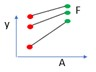

# Presenting results as tables and graphs  2 factorial expts {#factor}

Narrower topic 	()
Sam		Can we make it relevant to observational studies as well as expts?

## Introduction

A common task in presenting results is how to show differences in a numeric outcome variable across multiple different explanatory variables. Often this will result from conducting a factorial treatment experiment, for example a randomised complete block design looking at whether yield varies across 5 different varieties of a crop, with 3 different levels of nitrogen fertiliser used. 

Particularly with factorial experiment - the design has been arrived at with a purpose in mind already. That purpose should be reflected in the way they are analysed and presented.

When visualising these results we should be thinking of ways to clearly and effectively show the impacts of all of these different factors - not just show produce plots sowing the 'best' or the 'worst;


## Embed Video Here

(Not this video but just demo-ing functionality)

```{r,echo=FALSE,out.width="100%"}
knitr::include_url("https://www.youtube.com/embed/lbt4BH9Q82E")
```


## Overall principles
*	There is never only one right way to present results. But there are ways that are more or less effective at getting over a message. Trial and error of different plot configurations before committing to one is a really useful process for thinking through and refining the presentation. Don't expect to immediately land on the 'best' answer.

What is effective depends on:
*	The message or objectives. The same data can be presented in different ways to highlight different trends.
*	The design or structure of the data. Consider how many different variables you have, and how many response levels are in those variables, and what sort 
*	The actual observed data - this will inform scales, transformations and may lead you into presenting results in multiple different plots, or all in a single plot.
*	The intended audience - a plot for publication in a journal is unlikely to be as effective if used in a presentation for a conference. And a technical audience will look for different things, and have different expectations when looking at a plot to a more general audience.

## Example Data

The following apply to any response that is measured on experimental units, even if we usually think of a continuous variable typified by ‘yield’. We are going to use some simulated data in this document to show the process for comparing 'yield' across a factorial experiment. The design incorporates two treatment factors -  "Type" (A, B or C) and "Inputs" (0, 100 or 200). There were 20 farmers who all included the 9 treatment combinations. The 20 farmers are split across 3 sites (X, Y and Z) and we may also be interested in assessing the gender of the farmer (Male or Female).


```{r}
set.seed(46)

library(tidyverse)
dt1<-expand.grid(Type=c("A","B","C"),Inputs=c(0,100,200),Farmer=1:20) %>%
  full_join(data.frame(Farmer=1:20,Gender=sample(c("Male","Female"),20,replace=TRUE),Site=c(rep("X",8),rep("Y",7),rep("Z",5)),ranef=rnorm(20,sd=2)))


## simulations. Ignore Gender.
## Sites different - X high Y low Z middle
## Inputs different - increase with Input
## Type effect - C high with high input and high with X
## B high with low input and high with Y
## A in middle
dt1$Yield<-NA
dt1$Yield<-ifelse(dt1$Site=="X" & dt1$Inputs==0 & dt1$Type == "A", rnorm(8,10,2),dt1$Yield)
dt1$Yield<-ifelse(dt1$Site=="X" & dt1$Inputs==100 & dt1$Type == "A", rnorm(8,12,2),dt1$Yield)
dt1$Yield<-ifelse(dt1$Site=="X" & dt1$Inputs==200 & dt1$Type == "A", rnorm(8,15,2),dt1$Yield)

dt1$Yield<-ifelse(dt1$Site=="X" & dt1$Inputs==0 & dt1$Type == "B", rnorm(8,9,2),dt1$Yield)
dt1$Yield<-ifelse(dt1$Site=="X" & dt1$Inputs==100 & dt1$Type == "B", rnorm(8,10,2),dt1$Yield)
dt1$Yield<-ifelse(dt1$Site=="X" & dt1$Inputs==200 & dt1$Type == "B", rnorm(8,11,2),dt1$Yield)

dt1$Yield<-ifelse(dt1$Site=="X" & dt1$Inputs==0 & dt1$Type == "C", rnorm(8,12,2),dt1$Yield)
dt1$Yield<-ifelse(dt1$Site=="X" & dt1$Inputs==100 & dt1$Type == "C", rnorm(8,15,2),dt1$Yield)
dt1$Yield<-ifelse(dt1$Site=="X" & dt1$Inputs==200 & dt1$Type == "C", rnorm(8,18,2),dt1$Yield)

dt1$Yield<-ifelse(dt1$Site=="Y" & dt1$Inputs==0 & dt1$Type == "A", rnorm(7,5,2),dt1$Yield)
dt1$Yield<-ifelse(dt1$Site=="Y" & dt1$Inputs==100 & dt1$Type == "A", rnorm(7,6,2),dt1$Yield)
dt1$Yield<-ifelse(dt1$Site=="Y" & dt1$Inputs==200 & dt1$Type == "A", rnorm(7,7,2),dt1$Yield)

dt1$Yield<-ifelse(dt1$Site=="Y" & dt1$Inputs==0 & dt1$Type == "B", rnorm(7,7,2),dt1$Yield)
dt1$Yield<-ifelse(dt1$Site=="Y" & dt1$Inputs==100 & dt1$Type == "B", rnorm(7,9,2),dt1$Yield)
dt1$Yield<-ifelse(dt1$Site=="Y" & dt1$Inputs==200 & dt1$Type == "B", rnorm(7,10,2),dt1$Yield)

dt1$Yield<-ifelse(dt1$Site=="Y" & dt1$Inputs==0 & dt1$Type == "C", rnorm(7,5,2),dt1$Yield)
dt1$Yield<-ifelse(dt1$Site=="Y" & dt1$Inputs==100 & dt1$Type == "C", rnorm(7,6,2),dt1$Yield)
dt1$Yield<-ifelse(dt1$Site=="Y" & dt1$Inputs==200 & dt1$Type == "C", rnorm(7,7,2),dt1$Yield)

dt1$Yield<-ifelse(dt1$Site=="Z" & dt1$Inputs==0 & dt1$Type == "A", rnorm(5,10,2),dt1$Yield)
dt1$Yield<-ifelse(dt1$Site=="Z" & dt1$Inputs==100 & dt1$Type == "A", rnorm(5,12,2),dt1$Yield)
dt1$Yield<-ifelse(dt1$Site=="Z" & dt1$Inputs==200 & dt1$Type == "A", rnorm(5,15,2),dt1$Yield)

dt1$Yield<-ifelse(dt1$Site=="Z" & dt1$Inputs==0 & dt1$Type == "B", rnorm(5,8,2),dt1$Yield)
dt1$Yield<-ifelse(dt1$Site=="Z" & dt1$Inputs==100 & dt1$Type == "B", rnorm(5,10,2),dt1$Yield)
dt1$Yield<-ifelse(dt1$Site=="Z" & dt1$Inputs==200 & dt1$Type == "B", rnorm(5,11,2),dt1$Yield)

dt1$Yield<-ifelse(dt1$Site=="Z" & dt1$Inputs==0 & dt1$Type == "C", rnorm(5,10,2),dt1$Yield)
dt1$Yield<-ifelse(dt1$Site=="Z" & dt1$Inputs==100 & dt1$Type == "C", rnorm(5,12,2),dt1$Yield)
dt1$Yield<-ifelse(dt1$Site=="Z" & dt1$Inputs==200 & dt1$Type == "C", rnorm(5,15,2),dt1$Yield)

dt1$Yield<-dt1$Yield+rnorm(nrow(dt1),mean=dt1$ranef,sd=0.1)
dt1$Inputs<-factor(dt1$Inputs)

```


## Key ideas

1. Response to stimulus or input is observed at discrete treatment levels. In the example dataset we have created the 'response' is yield and the main treatment levels we are considering are the combinations of 'type' and 'inputs'. We have 9 combinations in total, three levels of type and three levels of inputs, and 20 observations of each combination coming from the 20 farms. Therefore we have 9 mean yield values, and 9 distributions of yield, that we need to compare to be able to assess the results.

```{r}
dt1 %>% 
  group_by(Type,Inputs) %>%
    summarise("n"=n(),"Mean Yield"=round(mean(Yield),1),"SD Yield"=round(sd(Yield),1))

```

Simply looking at the numbers in a table, or conducting the standard analysis of variance, is not going to tell us as much as a well thought through visualisation. However the ANOVA results here do help to inform us that there are statistically significant effects of type, inputs and the interaction between the type and inputs within this trial.

```{r}
library(lmerTest)

lmer(Yield~Type*Inputs+(1|Farmer),data=dt1) %>%
  anova()

```


2. Conventional plot:   input or stimulus F = horizontal , response y = vertical

```{r}
ggplot(aes(y=Yield,x=Type,group=1),data=dt1) +
  stat_summary(geom="line")+
    stat_summary(geom="point",colour="red",size=4)+
      ylab("Mean Yield")
```

```{r}
ggplot(aes(y=Yield,x=Inputs,group=1),data=dt1) +
  stat_summary(geom="line")+
    stat_summary(geom="point",colour="red",size=4)+
      ylab("Mean Yield")
```


3. Interaction: modification of, or non-parallel, response curves

```{r}
ggplot(aes(y=Yield,x=Inputs,group=Type,colour=Type),data=dt1) +
  stat_summary(geom="line")+
    stat_summary(geom="point",size=4)+
      ylab("Mean Yield")
```

4. More than two factors (F, A, B,…): same applies but more choices now and higher order interactions hard to interpret. Two choices:
5. A, B, … of equal status or interest: one line for each combination of A and B.

```{r}
ggplot(aes(y=Yield,x=Inputs,group=interaction(Type,Site),colour=interaction(Type,Site)),data=dt1) +
  stat_summary(geom="line")+
    stat_summary(geom="point",size=4)+
      ylab("Mean Yield")
```


6. Primary focus on FxA, with B… modifiers or varying context: use B,… as facets so that the FxA pattern can be compared.

```{r}
ggplot(aes(y=Yield,x=Inputs,group=Type,colour=Type),data=dt1) +
  stat_summary(geom="line")+
    stat_summary(geom="point",size=4)+
  facet_wrap(~Site)+
      ylab("Mean Yield")
```

7. The FxA interaction and presentation is identical information content as the AxF  interaction and presentation. But the message that it is easy to read from the two is not the same.  Hence (a) for a specific objective or story, one will be more effective than another, (b) there may not be only one way to present, (c) with >2 factors the possibilities increase rapidly


```{r}
ggplot(aes(y=Yield,x=Site,group=Type,colour=Type),data=dt1) +
  stat_summary(geom="line")+
    stat_summary(geom="point",size=4)+
      ylab("Mean Yield")
```

```{r}
ggplot(aes(y=Yield,x=Type,group=Site,colour=Site),data=dt1) +
  stat_summary(geom="line")+
    stat_summary(geom="point",size=4)+
      ylab("Mean Yield")
```



8. In practice, the observations on the graph come with uncertainty in their position. Part of the function of statistical analysis is to estimate the uncertainty so that (a) it can also be represented on the graph  (b) we can separate pattern that is noise (possibly just due to random, unrepeatable variation) from that which is signal (repeatable, consistent across repetitions).

```{r}
ggplot(aes(y=Yield,x=Type,group=Site,colour=Site),data=dt1) +
  stat_summary(geom="line")+
    stat_summary(fun.data=mean_cl_normal)+
      ylab("Mean Yield")
```

9. If the effect of one or more factors is considered noise  then we can average over them and display main effects (…  hard to explain this concisely. Its not just main effects but eg FxA in an experiment with F, A and B…)

```{r}
ggplot(aes(y=Yield,x=Inputs),data=dt1) +
  stat_summary(geom="line",aes(group=1))+
    stat_summary(geom="point",aes(group=Gender,col=Gender),size=4)+
      ylab("Mean Yield")
```


## Fun shiny test

```{r,echo=FALSE,out.width="100%"}
knitr::include_url("https://shiny.stats4sd.org/factorialexperiments",height="1000px")
```


## In practice

### Step 1: Set out the objectives, message or hypothesis for the story you want to tell with the graph you are designing

a. >There may be several in one data set, so think which it is. Multiple graphs can be created to illustrate different messages. If it can be stated as something like ‘We know y responds to F.  The hypothesis investigated concerns the way this response is modified by A. We expect…    This modification will be higher at B=1 than at B=0 …’
b. >In all this discussion, it does not really matter which factors are strictly treatments (randomised in the design) and which are unrandomized context factors (eg location). It makes a difference to the statistical analysis and the nature of inference, but not to the drawing of graphs.
c. >Likewise, complexities in layout (eg Is it split-plot design? Where there incomplete blocks?...) affect the stats not design of the graphs. 
d. >Experiments often have treatment structure that is partially or not-quite a factorial.  That’s ok – most of what is here still applies but there might be a few points that are not there or extras added.


### Step 2: Remember experiments are set up to make comparisons
a. >Generally the absolute level of y is less important than differences.


### Step 3: Maintain the visual metaphor
a. >One rule of graphics: So we break the rule of response on the vertical axis with something like this:
b. >If the horizontal axis is quantitative then the order is natural. If it is qualitative try to find an ordering that adds some value eg – order by level of another variable, by some property of the category,… Definitely do not just keep the data order, which is likely to be nothing more than purely alphabetical.


### Step 4: Lines	 
a.	>I like to join points even of levels of F are discrete because it shows up which points are logically connected and the concept of interaction = non-parallel become visual.

### Step 5: Multiple factors	 
a.	>More than2 factors is actually common when you remember that location and year are often there. It would be natural to have an aim of looking at the what response to F is modified by A and whether that is the same each season (S)  and local (L)

### Step 6: Colours and symbols	 
a.	>Remember you can vary colour, symbol, line style….  So if we plot FxAxB it might be with levels of A as solid v broken, levels of B as    red v green.


### Step 7: Facets	 
a.	>So the FxA experiment done in 2 locations in each of 2 seasons could be plotted with a facet grid…


### Step 8: Interate	 
a.	>Talking to researchers about real experiments almost always leads to discussion about response to one factor (often known) be modified by one or more others. The challenge: find examples in agric where that is not the case!  If you really don’t want to make the distinction then…?  Resorting to multiple factors on the x-axis is rarely a great idea….

### Step 9: Next steps
a.	>Plotting responses that have been averaged over levels of one or more factors ( not getting into messy questions about weights etc)
b.	>Statistical significance v practice significance ( eg a graph of main effects might be useful even if there is statistically significant interaction as long as it is small) 
c.	>Representing uncertainty. The standard ‘error bars’ on means are actually meaningless for most experimental data. SEDs and CIs of differences better but only easy for neat experiments. Etc
d.	 >Related to points b) and c) – providing context within the plot related to sample sizes and design – build in information to help audience assess the robustness of the level of evidence provided. 
