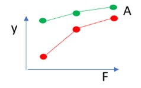

# Presenting results as tables and graphs  2 factorial expts {#factor}

Narrower topic 	()
Sam		Can we make it relevant to observational studies as well as expts?

## Embed Video Here

(Not this video but just demo-ing functionality)

```{r,echo=FALSE,out.width="100%"}
knitr::include_url("https://www.youtube.com/embed/lbt4BH9Q82E")
```


## Overall principles
*	There is never only one right way to present results. But there are ways that are more or less effective at getting over a message.
*	What is effective depends on
*	The message or objectives
*	The design or structure of the data
*	The actual observed data
*	The intended  audience
*	Factorial experiment are designed like that for a reason and that should be reflected in the way they are analysed and presented.

The following apply to any response that is measured on experimental units, even if we usually think of a continuous variable  typified by ‘yield’

## Key ideas

1. Response to stimulus or input is observed at discrete treatment levels
2. Conventional plot:   input or stimulus F = horizontal , response y = vertical

3. Interaction: modification of, or non-parallel, response curves

4. More than two factors (F, A, B,…): same applies but more choices now and higher order interactions hard to interpret. Two choices:
5. A, B, … of equal status or interest: one line for each combination of A and B.
6. Primary focus on FxA, with B… modifiers or varying context: use B,… as facets so that the FxA pattern can be compared.
7. The FxA interaction and presentation is identical information content as the AxF  interaction and presentation. But the message that it is easy to read from the two is not the same.  Hence (a) for a specific objective or story, one will be more effective than another, (b) there may not be only one way to present, (c) with >2 factors the possibilities increase rapidly

8. In practice, the observations on the graph come with uncertainty in their position. Part of the function of statistical analysis is to estimate the uncertainty so that (a) it can also be represented on the graph  (b) we can separate pattern that is noise (possibly just due to random, unrepeatable variation) from that which is signal (repeatable, consistent across repetitions).
9. If the effect of one or more factors is considered noise  then we can average over them and display main effects (…  hard to explain this concisely. Its not just main effects but eg FxA in an experiment with F, A and B…)


## Fun shiny test

```{r,echo=FALSE,out.width="100%"}
knitr::include_url("https://shiny.stats4sd.org/factorialexperiments",height="1000px")
```


## In practice

### Step 1: Set out the objectives, message or hypothesis for the story you want to tell with the graph you are designing

a. >There may be several in one data set, so think which it is. Multiple graphs can be created to illustrate different messages. If it can be stated as something like ‘We know y responds to F.  The hypothesis investigated concerns the way this response is modified by A. We expect…    This modification will be higher at B=1 than at B=0 …’
b. >In all this discussion, it does not really matter which factors are strictly treatments (randomised in the design) and which are unrandomized context factors (eg location). It makes a difference to the statistical analysis and the nature of inference, but not to the drawing of graphs.
c. >Likewise, complexities in layout (eg Is it split-plot design? Where there incomplete blocks?...) affect the stats not design of the graphs. 
d. >Experiments often have treatment structure that is partially or not-quite a factorial.  That’s ok – most of what is here still applies but there might be a few points that are not there or extras added.


### Step 2: Remember experiments are set up to make comparisons
a. >Generally the absolute level of y is less important than differences.


### Step 3: Maintain the visual metaphor
a. >One rule of graphics: So we break the rule of response on the vertical axis with something like this:
b. >If the horizontal axis is quantitative then the order is natural. If it is qualitative try to find an ordering that adds some value eg – order by level of another variable, by some property of the category,… Definitely do not just keep the data order, which is likely to be nothing more than purely alphabetical.


### Step 4: Lines	 
a.	>I like to join points even of levels of F are discrete because it shows up which points are logically connected and the concept of interaction = non-parallel become visual.

### Step 5: Multiple factors	 
a.	>More than2 factors is actually common when you remember that location and year are often there. It would be natural to have an aim of looking at the what response to F is modified by A and whether that is the same each season (S)  and local (L)

### Step 6: Colours and symbols	 
a.	>Remember you can vary colour, symbol, line style….  So if we plot FxAxB it might be with levels of A as solid v broken, levels of B as    red v green.


### Step 7: Facets	 
a.	>So the FxA experiment done in 2 locations in each of 2 seasons could be plotted with a facet grid…


### Step 8: Interate	 
a.	>Talking to researchers about real experiments almost always leads to discussion about response to one factor (often known) be modified by one or more others. The challenge: find examples in agric where that is not the case!  If you really don’t want to make the distinction then…?  Resorting to multiple factors on the x-axis is rarely a great idea….

### Step 9: Next steps
a.	>Plotting responses that have been averaged over levels of one or more factors ( not getting into messy questions about weights etc)
b.	>Statistical significance v practice significance ( eg a graph of main effects might be useful even if there is statistically significant interaction as long as it is small) 
c.	>Representing uncertainty. The standard ‘error bars’ on means are actually meaningless for most experimental data. SEDs and CIs of differences better but only easy for neat experiments. Etc
d.	 >Related to points b) and c) – providing context within the plot related to sample sizes and design – build in information to help audience assess the robustness of the level of evidence provided. 
