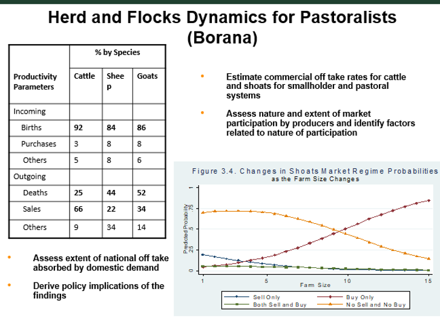

# Adapting to the audience {#audience1}

*Nicolas Greliche*

## Video

```{r,echo=FALSE,out.width="100%",fig.cap="https://youtu.be/7a7x67XAu_I"}
knitr::include_url("https://www.youtube.com/embed/7a7x67XAu_I")
```

## Without a conscious effort, a presentation is unlikely to be well adapted to its audience

When we prepare a presentation, it is easy to simply imagine ourselves as the audience and use this perspective to decide what to show and how. Unfortunately, we are not at all a good representative sample of our future audience because:

-	We already know what the presentation is about
-	Even if we imagine knowing nothing about the content of the presentation, we can't help but imagine someone with a knowledge, background and way of reasoning that is similar to ours... and that kind of person cannot be representative of the audience either.

So, when we prepare a presentation, it is very important that we make a conscious effort of adapting it to our audience. Otherwise, we're likely to lose this audience at some point or another. Here are the reasons why:


1.	**Your audience comes with a specific background** - Some might be researchers, others might be students. They might be working in the same field as you, but in a different context, or they might also be working in a completely different field. And we need to adapt the presentation to the diversity of the backgrounds. That's probably the most obvious of the things to be aware of when presenting results.

2.	**The audience know less than we think they know** - This one is a bit of a stretch. What we mean by that is that that the audience know very little. They might actually know a lot about the topic, maybe even more than you. But their knowledge will always come from a perspective and experience that is different from yours. And in the end, they will nearly always be weaker than you think in terms of knowledge that align with your personal approach to things. So when you try and evaluate the knowledge level of your audience, keep in mind that your evaluation is always too optimistic.

3.	**The audience is not in our brain** - We can't assume that a reasoning process that makes sense to us will automatically make sense to them. So, we always need to guide the audience in our reasoning process, even when it seems obvious to us.

4.	**We are not in the audience’s brain either** - naturally the audience will not look exactly where we want them to look at and they will likely be distracted by things that would not necessarily distract us. And so here again, we need to account for it and guide them, so that they remain with us at all time throughout the presentation.


## So what to do?

Here are some things you can do to address each of the points raised above:

### 1. Our audience comes with a specific background

To address the issue of the audience coming with a specific background, likely to be a bit different from ours, you should  

-	Try to use terms and vocabulary that will be understood by everyone - avoid jargon and acronyms as much as possible !  
-	Try to put yourself in the shoes of each type of person likely to be there as your audience. And simply ask yourself “If I had this particular background, What would help me to follow the presentation?”  
-	Be sure to clearly explain all the things without which someone would not be able to follow the presentation. That said, don't forget about time. Try to focus on explaining **only** the things that are absolutely necessary to follow the presentation. Be very selective about what you say, and when in doubt, skip it.
***Say little, but say it very clearly!*** (and keep the rest for the questions)


### 2. Our audience know less than we think they know

-	To address this issue, always double-check the key parts of your script. These things that are necessary to follow your presentation. Will someone who has only very basic knowledge about the area be able to follow it? If you're not totally sure whether something essential in your presentation is clear enough, then it is probably not clear enough. Make it clearer. And if your presentation becomes too long, rethink what is essential and what is not, and skip what is not.


### 3. Our audience is not in our brain

Here are a few recommendation to make sure you’re not loosing your audience in your reasoning:

-	Whenever you're talking about a process that is a bit complex, give a very quick overview about the process first, to prepare the audience for what is coming.  
-	Don't hesitate to repeat yourself in order to make your main points and your reasoning very clear.  
-	Whenever you find yourself thinking "well I don't need to say that. It will be clear by looking at the slide". Stop! This kind of thought is a strong indication that you actually ***need*** to say that thing.


### 4. We are not in the audience’s brain either

I am going to spend a bit more time on this one, because I think it is the point that is the most overlooked, while the actions to address it might be the easiest to implement. Here is how you can address it:

#### Have each graph or table be on its own slide

Make your slides in a way that forces the audience to look at what you want them to look at, that is, limit the number of things on a slide to a minimum, so that the audience doesn't have any choice but to follow the path you decided for them. A slide such at the following one is filled with lots of information.



Anyone exposed to it would have a lot of choices for things to look at. They could look at the table or the graph. They could also read the title, the rest of the text... Clearly all these information can't all be relevant at the same time. A presenter showing such slide could try to direct the audience, but chances are that all these things on the slide will distract this audience at one point or another from what the presenter is saying. In contrast, if the presenter put these items on different slides, in an order that align with their script, there’s nothing to do for the audience but to follow what the presenter wants to show.  


#### Put little text

Keep the amount of text on slides to a minimum. Having a lot of text is probably ***the*** best way to annoy an audience. Because it is boring, but also because for lots of people it is hard not to read what’s in front of them, and since reading and listening at the same time is extremely difficult, these people will not be able to follow what you’re saying. And if you need text to help you remember what you have to say, remember that PowerPoint has a note section that is made exactly for that. So move your script in the note section, and in the slide, add a picture that illustrates what you’re saying. Ideally, you want the picture to be referred to in the script, so that it is not just illustrative, but also useful!


#### Simplify your slide and guide your audience

When what you put on a slide is a bit complex, first, try to simplify it, and if you can't, make sure you guide the audience through it. A good example is graphs. Graphs are always complex, to some degree. There are axes, shapes, colours, numbers, labels... many things to look at and they all require some time to be understood. Even if it's just for a few seconds, an audience that is trying to understand a graph will not be able to fully focus on what you're saying. So, don't make the audience figure things out on their own. You know that they will spend a moment figuring out the graph anyway, so you might as well go along with that, rather than say something in that moment that they will miss! Do the work for them by guiding them through the components of the graphs each time you have a graph on your slides; And the same goes for tables.


## A few tips and tricks

Here are a couple of tricks that could help you to follow some of the guidelines discussed above, without really trying to:

#### Imagine you're explaining things to a 10 years old kid

A good trick is to plan your presentation by imagining that you’re explaining things to a 10 year-old kid; it's a bit extreme, but it will force you to be clear, only focus on the important, and to guide your audience during the presentation.

If you make a presentation that a 10 year-old kid can follow and understand, you will have made a very good presentation!

#### Do your presentation live, using a piece of paper first

Another trick is to try and do the presentation live, on a piece of paper before going into PowerPoint. Indeed, the issue with slides is that you build them in advance. It's partly an advantage of course, as it allows you to put nice graphs, as well as let you think about the design. But it is also a disadvantage because since you don’t have the audience in front of you while you’re preparing your slides, the idea of guiding the audience is not intuitive. In contrast, when you explain something to someone, using a pen and a blank piece of paper, you intuitively guide the person with your pen and write or draw things only when it’s relevant. If you then plan the order and content of your slides according to how you present things with pen and paper, your presentation will likely be very good!


## Challenging the counter-arguments

There are also arguments for doing things differently than suggested here. Let's address some of these:

#### It's time consuming!

Planning well and thinking about all of points and suggestions we've discussed is time consuming. Yes. That's true. It is definitely time consuming. So there is a Balance to find. But keep in mind that if the audience doesn’t understand your presentation, your presentation becomes pointless!

#### The ppt presentation should sometime work as standalone material

There is an argument for having lots of text and information in the slides rather than keeping these to a minimum to not distract the audience from what you’re saying. This argument is that sometimes, PowerPoint presentations are also intended to become standalone material. In such situation, one might think that all the information that would be given by the presenter should be in the slides. Well maybe, but there are good alternatives to that. First, as said earlier, you can actually place your full script in the note section, which is part of your PowerPoint file, so if you share your slides, you also share your script. You can also maybe make a separate version of the slides that is specifically for sharing. And finally what about sharing a recording of the presentation?


## Special case of a presentation of results shown to farmers - Video

```{r,echo=FALSE,out.width="100%",fig.cap="https://youtu.be/slM6ZjeukE4"}
knitr::include_url("https://www.youtube.com/embed/slM6ZjeukE4")
```
All of the above is very relevant to the special case of presenting results to farmers, but the difference between farmers and you in terms of background, knowledge and way of reasoning is so important that we need to come back to the main points and develop them further. Because adapting to a farmer audience is not easy.

### Difference of background/knowledge

Usually, farmers don’t have any familiarity with research or statistics and they may put more trust and value into stories or anecdotes than on the abstract generalisation that researchers hope to discover. When presenting results to farmers, it is therefore important to keep this in mind and to try hard to make results very relatable. Here are some tips to help you with that:
- Try to present things in a way that is familiar to them: explain how results have been obtained in a way that follows the usual process in a farm for example. Use examples or anecdote to help them relate to what you are talking about.  
-	It might be easiest to understand a graph if they can find themselves on the graph, where each farmer is represented by a point or a line. Emphasize it by giving examples.  
- Try to focus on the results that are useful for them.  
-	Keep in mind that sometimes it might be more fruitful to let a farmer present the results. In that case, you might need to go beyond presenting and provide training on presenting the results to some of the farmers.

### A different way of reasoning

What is very difficult when presenting results to a farmer audience is that it is hard to know how they will look at a slide, a picture or a graph, as well as what you should say or show to convey your message and make sure they understand why it is relevant to them. The literature remains relatively thin on the subject, and specific tips are hard to provide, but putting some extra attention to the following should help: 
-	Put little text and avoid tables. Not all farmers know how to read, so you should really focus on visual representations.  
-	Choose colours, icons, pictures very carefully. Icons can help, but if not chosen carefully they can actually do more harm than good.  
-	You may want to keep things extra simple, but more important is making sure that what is shown is intuitive. Because Farmers can understand complex graphs when it is made intuitive to them. But it is not easy to guess what will be intuitive to farmers. For example, a barchart is one of the simplest type of graphs, but it is may be much less intuitive than complex graphs where the farmers can identify themselves.  
-	Provide lots of guidance. That's obvious. But it is as important to be very receptive to farmers reactions and adapt to it. Spend more time on the things they are interested in, and on the key points where you feel they struggle. Skip the things where you feel they struggle too much though.

### Have an open mind

And there’s one last think that is really important when presenting results to farmers. It is to keep an open mind and be ready to learn things from the farmers as much as they learn from you. Because their perspective on things is unique and if you accept to genuinely accept and listen to it, you will quickly realise how valuable and insightful it is!

