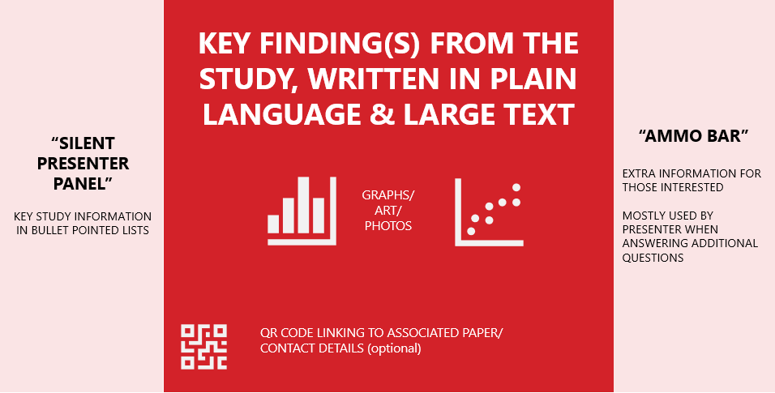

--- 
title: "Resources on Presenting Results"
author: "RMS"
date: "`r Sys.Date()`"
site: bookdown::bookdown_site
output: bookdown::gitbook
documentclass: book
bibliography: [book.bib, packages.bib]
biblio-style: apalike
link-citations: yes
github-repo: rstudio/bookdown-demo
description: "This is a document compiling various resources on how to present results from different types of data, for different audiences and different purposes"
---

# Introduction

This page is an introduction. I will write some text later

## Contents

[Presenting results as story telling](#story)
One line summary

[Presenting results as tables and graphs 1](#tablegraph1)
One line summary

[Presenting results as tables and graphs  2 factorial expts ](#factor)
One line summary

[Presenting results as tables and graphs  3 Precision](#precision)
One line summary

[Presenting results as tables and graphs  4 for farmers](#farmers)
One line summary

[Presenting in papers](#papers)
One line summary

[Presenting on posters](#posters)
One line summary

[Adapting to audiences](#audience)
One line summary

[Presenting as show and tell](#showandtell)
One line summary

[Reviewing,  critiquing and improving presentation](#review)
One line summary

<!--chapter:end:index.Rmd-->

# Presenting results as story telling {#story}

Introduction to the themes, approach and principles	
Ric

<!--chapter:end:01-storytelling.Rmd-->

# Presenting results as tables and graphs 1 {#tablegraph1}

Needed in all other sections	
Sam	Alex’s guide

<!--chapter:end:02-tablegraph1.Rmd-->

# Presenting results as tables and graphs  2 factorial expts {#factor}

Narrower topic 	()
Sam		Can we make it relevant to observational studies as well as expts?

## Introduction

A common task in presenting results is how to show differences in a numeric outcome variable across multiple different explanatory variables. Often this will result from conducting a factorial treatment experiment, for example a randomised complete block design looking at whether yield varies across 5 different varieties of a crop, with 3 different levels of nitrogen fertiliser used. 

Particularly with factorial experiment - the design has been arrived at with a purpose in mind already. That purpose should be reflected in the way they are analysed and presented.

When visualising these results we should be thinking of ways to clearly and effectively show the impacts of all of these different factors - not just show produce plots sowing the 'best' or the 'worst;


## Embed Video Here

(Not this video but just demo-ing functionality)

```{r,echo=FALSE,out.width="100%"}
knitr::include_url("https://www.youtube.com/embed/lbt4BH9Q82E")
```


## Overall principles
*	There is never only one right way to present results. But there are ways that are more or less effective at getting over a message. Trial and error of different plot configurations before committing to one is a really useful process for thinking through and refining the presentation. Don't expect to immediately land on the 'best' answer.

What is effective depends on:
*	The message or objectives. The same data can be presented in different ways to highlight different trends.
*	The design or structure of the data. Consider how many different variables you have, and how many response levels are in those variables, and what sort 
*	The actual observed data - this will inform scales, transformations and may lead you into presenting results in multiple different plots, or all in a single plot.
*	The intended audience - a plot for publication in a journal is unlikely to be as effective if used in a presentation for a conference. And a technical audience will look for different things, and have different expectations when looking at a plot to a more general audience.

## Example Data

The following apply to any response that is measured on experimental units, even if we usually think of a continuous variable typified by ‘yield’. We are going to use some simulated data in this document to show the process for comparing 'yield' across a factorial experiment. The design incorporates two treatment factors -  "Type" (A, B or C) and "Inputs" (0, 100 or 200). There were 20 farmers who all included the 9 treatment combinations. The 20 farmers are split across 3 sites (X, Y and Z) and we may also be interested in assessing the gender of the farmer (Male or Female).


```{r}
set.seed(46)

library(tidyverse)
dt1<-expand.grid(Type=c("A","B","C"),Inputs=c(0,100,200),Farmer=1:20) %>%
  full_join(data.frame(Farmer=1:20,Gender=sample(c("Male","Female"),20,replace=TRUE),Site=c(rep("X",8),rep("Y",7),rep("Z",5)),ranef=rnorm(20,sd=2)))


## simulations. Ignore Gender.
## Sites different - X high Y low Z middle
## Inputs different - increase with Input
## Type effect - C high with high input and high with X
## B high with low input and high with Y
## A in middle
dt1$Yield<-NA
dt1$Yield<-ifelse(dt1$Site=="X" & dt1$Inputs==0 & dt1$Type == "A", rnorm(8,10,2),dt1$Yield)
dt1$Yield<-ifelse(dt1$Site=="X" & dt1$Inputs==100 & dt1$Type == "A", rnorm(8,12,2),dt1$Yield)
dt1$Yield<-ifelse(dt1$Site=="X" & dt1$Inputs==200 & dt1$Type == "A", rnorm(8,15,2),dt1$Yield)

dt1$Yield<-ifelse(dt1$Site=="X" & dt1$Inputs==0 & dt1$Type == "B", rnorm(8,9,2),dt1$Yield)
dt1$Yield<-ifelse(dt1$Site=="X" & dt1$Inputs==100 & dt1$Type == "B", rnorm(8,10,2),dt1$Yield)
dt1$Yield<-ifelse(dt1$Site=="X" & dt1$Inputs==200 & dt1$Type == "B", rnorm(8,11,2),dt1$Yield)

dt1$Yield<-ifelse(dt1$Site=="X" & dt1$Inputs==0 & dt1$Type == "C", rnorm(8,12,2),dt1$Yield)
dt1$Yield<-ifelse(dt1$Site=="X" & dt1$Inputs==100 & dt1$Type == "C", rnorm(8,15,2),dt1$Yield)
dt1$Yield<-ifelse(dt1$Site=="X" & dt1$Inputs==200 & dt1$Type == "C", rnorm(8,18,2),dt1$Yield)

dt1$Yield<-ifelse(dt1$Site=="Y" & dt1$Inputs==0 & dt1$Type == "A", rnorm(7,5,2),dt1$Yield)
dt1$Yield<-ifelse(dt1$Site=="Y" & dt1$Inputs==100 & dt1$Type == "A", rnorm(7,6,2),dt1$Yield)
dt1$Yield<-ifelse(dt1$Site=="Y" & dt1$Inputs==200 & dt1$Type == "A", rnorm(7,7,2),dt1$Yield)

dt1$Yield<-ifelse(dt1$Site=="Y" & dt1$Inputs==0 & dt1$Type == "B", rnorm(7,7,2),dt1$Yield)
dt1$Yield<-ifelse(dt1$Site=="Y" & dt1$Inputs==100 & dt1$Type == "B", rnorm(7,9,2),dt1$Yield)
dt1$Yield<-ifelse(dt1$Site=="Y" & dt1$Inputs==200 & dt1$Type == "B", rnorm(7,10,2),dt1$Yield)

dt1$Yield<-ifelse(dt1$Site=="Y" & dt1$Inputs==0 & dt1$Type == "C", rnorm(7,5,2),dt1$Yield)
dt1$Yield<-ifelse(dt1$Site=="Y" & dt1$Inputs==100 & dt1$Type == "C", rnorm(7,6,2),dt1$Yield)
dt1$Yield<-ifelse(dt1$Site=="Y" & dt1$Inputs==200 & dt1$Type == "C", rnorm(7,7,2),dt1$Yield)

dt1$Yield<-ifelse(dt1$Site=="Z" & dt1$Inputs==0 & dt1$Type == "A", rnorm(5,10,2),dt1$Yield)
dt1$Yield<-ifelse(dt1$Site=="Z" & dt1$Inputs==100 & dt1$Type == "A", rnorm(5,12,2),dt1$Yield)
dt1$Yield<-ifelse(dt1$Site=="Z" & dt1$Inputs==200 & dt1$Type == "A", rnorm(5,15,2),dt1$Yield)

dt1$Yield<-ifelse(dt1$Site=="Z" & dt1$Inputs==0 & dt1$Type == "B", rnorm(5,8,2),dt1$Yield)
dt1$Yield<-ifelse(dt1$Site=="Z" & dt1$Inputs==100 & dt1$Type == "B", rnorm(5,10,2),dt1$Yield)
dt1$Yield<-ifelse(dt1$Site=="Z" & dt1$Inputs==200 & dt1$Type == "B", rnorm(5,11,2),dt1$Yield)

dt1$Yield<-ifelse(dt1$Site=="Z" & dt1$Inputs==0 & dt1$Type == "C", rnorm(5,10,2),dt1$Yield)
dt1$Yield<-ifelse(dt1$Site=="Z" & dt1$Inputs==100 & dt1$Type == "C", rnorm(5,12,2),dt1$Yield)
dt1$Yield<-ifelse(dt1$Site=="Z" & dt1$Inputs==200 & dt1$Type == "C", rnorm(5,15,2),dt1$Yield)

dt1$Yield<-dt1$Yield+rnorm(nrow(dt1),mean=dt1$ranef,sd=0.1)
dt1$Inputs<-factor(dt1$Inputs)

```


## Key ideas

1. Response to stimulus or input is observed at discrete treatment levels. In the example dataset we have created the 'response' is yield and the main treatment levels we are considering are the combinations of 'type' and 'inputs'. We have 9 combinations in total, three levels of type and three levels of inputs, and 20 observations of each combination coming from the 20 farms. Therefore we have 9 mean yield values, and 9 distributions of yield, that we need to compare to be able to assess the results.

```{r}
dt1 %>% 
  group_by(Type,Inputs) %>%
    summarise("n"=n(),"Mean Yield"=round(mean(Yield),1),"SD Yield"=round(sd(Yield),1))

```

Simply looking at the numbers in a table, or conducting the standard analysis of variance, is not going to tell us as much as a well thought through visualisation. However the ANOVA results here do help to inform us that there are statistically significant effects of type, inputs and the interaction between the type and inputs within this trial.

```{r}
library(lmerTest)

lmer(Yield~Type*Inputs+(1|Farmer),data=dt1) %>%
  anova()

```


2. Conventional plot:   input or stimulus F = horizontal , response y = vertical

```{r}
ggplot(aes(y=Yield,x=Type,group=1),data=dt1) +
  stat_summary(geom="line")+
    stat_summary(geom="point",colour="red",size=4)+
      ylab("Mean Yield")
```

```{r}
ggplot(aes(y=Yield,x=Inputs,group=1),data=dt1) +
  stat_summary(geom="line")+
    stat_summary(geom="point",colour="red",size=4)+
      ylab("Mean Yield")
```


3. Interaction: modification of, or non-parallel, response curves

```{r}
ggplot(aes(y=Yield,x=Inputs,group=Type,colour=Type),data=dt1) +
  stat_summary(geom="line")+
    stat_summary(geom="point",size=4)+
      ylab("Mean Yield")
```

4. More than two factors (F, A, B,…): same applies but more choices now and higher order interactions hard to interpret. Two choices:
5. A, B, … of equal status or interest: one line for each combination of A and B.

```{r}
ggplot(aes(y=Yield,x=Inputs,group=interaction(Type,Site),colour=interaction(Type,Site)),data=dt1) +
  stat_summary(geom="line")+
    stat_summary(geom="point",size=4)+
      ylab("Mean Yield")
```


6. Primary focus on FxA, with B… modifiers or varying context: use B,… as facets so that the FxA pattern can be compared.

```{r}
ggplot(aes(y=Yield,x=Inputs,group=Type,colour=Type),data=dt1) +
  stat_summary(geom="line")+
    stat_summary(geom="point",size=4)+
  facet_wrap(~Site)+
      ylab("Mean Yield")
```

7. The FxA interaction and presentation is identical information content as the AxF  interaction and presentation. But the message that it is easy to read from the two is not the same.  Hence (a) for a specific objective or story, one will be more effective than another, (b) there may not be only one way to present, (c) with >2 factors the possibilities increase rapidly


```{r}
ggplot(aes(y=Yield,x=Site,group=Type,colour=Type),data=dt1) +
  stat_summary(geom="line")+
    stat_summary(geom="point",size=4)+
      ylab("Mean Yield")
```

```{r}
ggplot(aes(y=Yield,x=Type,group=Site,colour=Site),data=dt1) +
  stat_summary(geom="line")+
    stat_summary(geom="point",size=4)+
      ylab("Mean Yield")
```


8. In practice, the observations on the graph come with uncertainty in their position. Part of the function of statistical analysis is to estimate the uncertainty so that (a) it can also be represented on the graph  (b) we can separate pattern that is noise (possibly just due to random, unrepeatable variation) from that which is signal (repeatable, consistent across repetitions).

```{r}
ggplot(aes(y=Yield,x=Type,group=Site,colour=Site),data=dt1) +
  stat_summary(geom="line")+
    stat_summary(fun.data=mean_cl_normal)+
      ylab("Mean Yield")
```

9. If the effect of one or more factors is considered noise  then we can average over them and display main effects (…  hard to explain this concisely. Its not just main effects but eg FxA in an experiment with F, A and B…)

```{r}
ggplot(aes(y=Yield,x=Inputs),data=dt1) +
  stat_summary(geom="line",aes(group=1))+
    stat_summary(geom="point",aes(group=Gender,col=Gender),size=4)+
      ylab("Mean Yield")
```


## Fun shiny test

```{r,echo=FALSE,out.width="100%"}
knitr::include_url("https://shiny.stats4sd.org/factorialexperiments",height="1000px")
```


## In practice

### Step 1: Set out the objectives, message or hypothesis for the story you want to tell with the graph you are designing

a. >There may be several in one data set, so think which it is. Multiple graphs can be created to illustrate different messages. If it can be stated as something like ‘We know y responds to F.  The hypothesis investigated concerns the way this response is modified by A. We expect…    This modification will be higher at B=1 than at B=0 …’
b. >In all this discussion, it does not really matter which factors are strictly treatments (randomised in the design) and which are unrandomized context factors (eg location). It makes a difference to the statistical analysis and the nature of inference, but not to the drawing of graphs.
c. >Likewise, complexities in layout (eg Is it split-plot design? Where there incomplete blocks?...) affect the stats not design of the graphs. 
d. >Experiments often have treatment structure that is partially or not-quite a factorial.  That’s ok – most of what is here still applies but there might be a few points that are not there or extras added.


### Step 2: Remember experiments are set up to make comparisons
a. >Generally the absolute level of y is less important than differences.


### Step 3: Maintain the visual metaphor
a. >One rule of graphics: So we break the rule of response on the vertical axis with something like this:
b. >If the horizontal axis is quantitative then the order is natural. If it is qualitative try to find an ordering that adds some value eg – order by level of another variable, by some property of the category,… Definitely do not just keep the data order, which is likely to be nothing more than purely alphabetical.


### Step 4: Lines	 
a.	>I like to join points even of levels of F are discrete because it shows up which points are logically connected and the concept of interaction = non-parallel become visual.

### Step 5: Multiple factors	 
a.	>More than2 factors is actually common when you remember that location and year are often there. It would be natural to have an aim of looking at the what response to F is modified by A and whether that is the same each season (S)  and local (L)

### Step 6: Colours and symbols	 
a.	>Remember you can vary colour, symbol, line style….  So if we plot FxAxB it might be with levels of A as solid v broken, levels of B as    red v green.


### Step 7: Facets	 
a.	>So the FxA experiment done in 2 locations in each of 2 seasons could be plotted with a facet grid…


### Step 8: Interate	 
a.	>Talking to researchers about real experiments almost always leads to discussion about response to one factor (often known) be modified by one or more others. The challenge: find examples in agric where that is not the case!  If you really don’t want to make the distinction then…?  Resorting to multiple factors on the x-axis is rarely a great idea….

### Step 9: Next steps
a.	>Plotting responses that have been averaged over levels of one or more factors ( not getting into messy questions about weights etc)
b.	>Statistical significance v practice significance ( eg a graph of main effects might be useful even if there is statistically significant interaction as long as it is small) 
c.	>Representing uncertainty. The standard ‘error bars’ on means are actually meaningless for most experimental data. SEDs and CIs of differences better but only easy for neat experiments. Etc
d.	 >Related to points b) and c) – providing context within the plot related to sample sizes and design – build in information to help audience assess the robustness of the level of evidence provided. 

<!--chapter:end:03-factorial.Rmd-->

# Presenting results as tables and graphs  3 Precision {#precision}

Narrower topic	Carlos/Sam		Old SSC docs to revise?

<!--chapter:end:04-precision.Rmd-->

# Presenting results as tables and graphs  4 for farmers {#farmers}

Focus on presenting qualitative data, not the broad topic of interacting with farmers	Nico (?)		Check with Nico if we have ideas for a short piece.

<!--chapter:end:05-farmers.Rmd-->

# Presenting in papers {#papers}

Ric


<!--chapter:end:06-papers.Rmd-->

# Presenting on posters {#posters}

*Alex Thomson*


## Video

```{r,echo=FALSE,out.width="100%"}
knitr::include_url("https://www.youtube.com/embed/lbt4BH9Q82E")
```

## The aim of posters

Academic research posters are a great way to engage with your scientific community by succinctly distilling your research onto a large display, crowded by your peers doing just the same.

These could be shown off in many different settings.

* Large scientific (inter-disciplinary) conferences
* Smaller conferences devoted mostly to your field
* Social media channels such as Twitter
* Small online meetings with fixed presentation schedules
* Blogs
* Other online settings such as Miro

Regardless of the setting, the sharing of research posters is designed to be a learning experience for both the presenter and the audience.

***For the presenter***,

* Share their research with the wider academic community
* Engage directly with their colleagues
* Receive feedback from their peers
* Develop their presentation and communication skills
* Networking opportunities

***For the audience***,

* Learn about the research currently happening within their community
* Engage directly with their colleagues
* Potentially gain insights which could aid in their own research
* Networking opportunities

## Key principles

### The importance of design and layout

Crucial to ensuring the effectiveness of your poster and making sure you are calable of attracting an audience for your poster.

For a virtual conference, you may not have to fight for an audience but you still will need to keep their attention and keep them interested.

An inaccessible or poor design can be very off putting.

* Put your sections into a logical flow so the audience knows where to read
* Avoid the dreaded "Wall of text"
* Avoid clutter, keep it tidy
* Avoid using images as a background
* Keep your colours and text consistent

Always think carefully about what might be expected by your audience and what might keep them entertained.

If possible, always reach out for feedback on a draft before creating a final poster.Friends, family, colleagues, supervisors, anyone. 

There are a couple base design types that have become common over the years.

***Traditional Design***


Each section within individual text boxes arranged into 2/3 columns oriented portrait or landscape.

This traditional design dominates most poster conferences and will likely be the most common format for any template posters you find online.

**Strengths**

* Useful for audiences requiring lots of detail
* Requires little application of creative/graphic design
* Easy to read and follow the order
* The basis for most templates

**Weaknesses**

* Can appear lazy simply because of how common this format is
* Often encourages the "Wall of text"
* Requires creativity in order to make this stand out
* Gaining attention relies more heavily on the title and imagery
* Common for people to just copy and paste from report into a template when using this design


***#betterposter design***

Suggested by American PhD student Mike Morrison in a series of videos critical of the traditional approach and design to posters. 

This has become a larger campaign being take up in real world applications and with plans in the works to conduct full studies into its efficacy.

The approach takes a user experience approach to poster design to increase the size of a potential audience, imporve readability and more memorable.

This is done by putting overwhelming emphasis on the key findings and results with these taking up the majority of the space on the page.

This is put in the center in plain language, supplemented by imagery, with information bars either side. 

The left panel (*silent presenter*) bullet points much of the normal information you would expect to find. 

While the right panel (*ammo bar*) is filed with additional information that find the study particularly interesting and largely used when the presenter is answering questions.


**Strengths**

* Avoids overloading the reader with information.
* Strongly limits the word count.
* Simple design to work with.
* QR codes can be included to link to copies of the poster, the study and contact details.
* Attracts the audience in with a key interesting statement.
* Tends to be written in more plain language than other posters, ignoring scientific jargon.
* More approachable to a wider variety of people.
* Less information means more likely to be remembered by the audience.

**Weaknesses**

* Mostly designed for in-person conferences.
* QR code being included assumes there are additional resources to link to. Not always the case.
* To a more critical audience, may appear simple and reductive.
* Still a new approach so may be a off-utting to some stuck in traditional ways
* Assumes you have a key finding to present.
 + May not be as appropriate for posters not designed for studies or those which prioritise methods
* "Ammo bar" assumes presence of a knowledgeable presenter



***Infographics***

Infographics are posters designed to provide lots of information and facts to the audience. Or alternatively to visually display some kind of theory/principle in an interesting way.

Usually requires high levels of creative design over graphics and images. Usually with the help of a graphic designer.

Can help in generating discussion of a complex subject.

Could be useful in providing context of an upcoming study, generating an argument for the importance of an upcoming study or reporting the initial descriptive results from a large survey. 

Assumes generally you have lots and lots of interesting numbers, results and facts to tell the audience. Or a theory which is easy to show off visually.

Can be off-putting to supply the audience with so much information at once.

```{r, echo = FALSE, fig.align='center', fig.height= 0.5}
knitr::include_graphics("img/infographic.jpg")
```
[Source of infographic: Visual.ly](https://visual.ly/community/Infographics/technology/infographics-benefits-their-use-online?utm_source=visually_embed)

***Be creative***

Your options are not limited to these ideas. Always be thinking about how you could ***be creative***

Your choices can be expanded or constrained by the setting and rules of your poster session.

*Consider the follwing questions and ideas*

* Are you allowed interactive elements?
  + Screens? Could include video
  + Handouts?
  + Physical models?
* Are they displayed on screens or paper?
  + on screens could be turned into an animated presentation
* Is it a virtual conference?
  + Do you have a scheduled presentation slot?
  + If so, engagement more reliant on your presentation skills and content over design
  + Is it on twitter?
  + Think about how you can use the medium to your advantage
  + Promote yourself and your poster
  + Could animate your poster as a GIF
  + Use the text to include additional contextual information not on the poster
  
### Keep it short and simple

Avoid the temptation to summarise every little thing about your study. You should be thinking about your poster as a **visual abstract**. Something to advertise your research and your skills.

* Focus on just **one or two key messages** about your study
  + This could be key findings or interesting innovations/applications of your methodology
* Prioritise including information that the audience **needs** to know first
* Only include information on the poster that is relevant to these key messages
  + You may have the chance to highlight other parts of your study when asked questions by audience members

> "It seems that perfection is attained not when there is nothing more to add, but when there is nothing more to remove" Antoine de Saint Exupery ^[Quoted originally in the #betterposter videos]

Use this quote as a guiding rule. Always ask yourself what is *needed*, *relevant*, and *engaging*.

There is no set rule when it comes to a word count although the rules of your session/conference may dictate one which you should follow.

* Some resources will say keep it under 1,000 words ^[Colin Purrington blog, see link above]
* Others around 300 - 800 ^[NYU guide, see link above]
* One guide even suggests restricting yourself down to just 250 ^[LSE guide, see link above]

The best advice that can be given here is to consider how much you are comfortable saying and how much it is you have to say, as well as think about what might the audience be expecting. 

The following sections are the standard parts to include for a research poster although what you need to include may depend on your purpose and how far along in your study you are.

***Introduction***

* Make this something quick to **grab the readers attention**
* Let them know *why* they should keep reading
* Get across the point and relevance of your study
* Perhaps draw them in with a hypothesis/research question

***Methods/Approach***

* To some this may actually be the most interesting part, especially if your method is quite innovative
  + if so, be sure to give this section great attention so you can explain why your method is special
* Otherwise, keep this section brief to focus on your findings and interpretations
* Where possible, display your approach through a diagram or pictures.   
  + Especially if the study was an experimental design or a trial

***Results***

* This will likely take up more space on the poster than any other section
* Only include the most interesting and relevant findings
  + Don't include anything that doesn't **need** to be there
* Unless your study was using qualitative data analysis, this section will likely include only short sentences
* Use graphs, maps, and tables which help to illustrate the key findings and messages

***Discussion/Conclusion***

* Some will choose to separate these two into different sections
* Focus only on interpreting your most relevant and interesting results
* Try to explain what your findings mean in plain language. 
* The audience will want to know *why* your results are important and interesting

***References***

* Always to be included if you reference any material on your poster
* Keep this small and to the bottom of the page

***Acknowledgements***

* Acknowledge your institution, employer, tutors and any colleagues who aided you.
* Good to provide contact details to keep up engagement after the session

### Make it engaging

If your poster is displayed at a conference, in person or online, you may be fighting for attention with hundreds of other posters within a limited time frame. 

You must attract and engaging.

Think about your poster as an advert for your research. What can you include to draw in potential "customers"?, how can you make them remember you?

This will come down to both your presentation and design of your poster as well as the interactions you have with your audience. 

***Tips to engage with your presentation***

* Grab them with your title. Consider making the title a statement of your key finding
* Use imagery
  + Photos
  + Graphs
  + Diagrams
  + Maps
* Don't use too many graphs
* Don't use overly-complicated hard to read graphs
* Avoid tables where possible
  + Keep them simple if they are used
* Avoid complicated inaccessible language
  + Broad plain language will be understood by a larger audience
* Use colour effectively
  + Don't use too many different colours. Pick a couple to design a colour palette/scheme
  + Avoid overly saturated colours
* Be creative with your medium
  + Can you use interactive screens?
  + Using twitter? Could animate your presentation as a GIF
  
Also think about the information that you include on your poster.

***What information is going to trigger interesting conversations with your audience?***

* Hypotheses
* Research Questions
* Surprising results
* Important recommendations
* New theories/models?
* Ask the audience questions to make them think
  
***Tips to engage with your interactions***

* Be prepared in advance to answer any and all questions
* Include your contact details prominently on your poster
* Consider printing out smaller hand out versions of your poster
* Details on where to find the paper and poster online
* Keep notes with additional notes at hand that you can refer to
* Advertise your poster beforehand using social media


### Some examples


This poster keeps the word count short to less than 300 words, down from a dissertation over 19,000 words, and picks out just two key descriptive findings

Maps and an interesting graph dominate the page to draw in the audience.


A large interesting diagram draws the eye

Shows that research and studies is not the only reason to make a poster as this is designed to illustrate key principles, examples and practices.

```{r, echo = FALSE, fig.align='center'}
knitr::include_graphics("img/GIS East Africa Poster.png")
```

Example 3: CCRP Poster - GIS East Africa Authors: Were K, Macharia PN, Nyamai M, Tanui LK, Okech P, Ngigi MM, Ngigi TG, Onchaga R, Matara S, Odhiambo S and Lali F

Again it is kept short and simple with many photos, maps and diagrams used to succinctly illustrate the key messages.


A smart use of the traditional design keeping the word count fairly low and choosing plenty of imagery to illustrate the results and methodology. 


Makes use of the traditional design also with good use of imagery and space, very informative and includes all relevant sections. Arguably may include too much text however. 


### Other resources

*Colin Purrington Blog filled with plenty of tips, dos and dont's and templates*

[Blog](https://colinpurrington.com/tips/poster-design/)

[Templates](https://colinpurrington.com/2019/06/templates-for-better-posters/)

*Some helpful guides provided by universities*

[New York University](https://guides.nyu.edu/posters)

[University of Reading](https://www.reading.ac.uk/web/files/dps/Conference_poster_PPT_examples.pdf)

[London School of Economics](https://blogs.lse.ac.uk/impactofsocialsciences/2018/05/11/how-to-design-an-award-winning-conference-poster/)

[University of Manchester](http://www.supi.manchester.ac.uk/forteachers/academicposterguidance/)

[UC Davis](https://urc.ucdavis.edu/creating-effective-academic-posters)

*#betterposter campaign*

[Video 1](https://www.youtube.com/watch?v=1RwJbhkCA58&t=2s&ab_channel=MikeMorrison)

[Video 2](https://www.youtube.com/watch?v=SYk29tnxASs&ab_channel=MikeMorrison)

[Video 3: Twitter Posters](https://www.youtube.com/watch?v=fQDL8r3r_d4&ab_channel=MikeMorrison)

[Response Article](https://www.insidehighered.com/news/2019/06/24/theres-movement-better-scientific-posters-are-they-really-better)

*Whole website devoted to academic research posters*

[Acedemicposter.org](https://www.academicposter.org/)

[PosterPresentations.com](https://www.posterpresentations.com/index.html)

*Academic Papers*

[Rowe and llic: Rethinking poster presentations at large-scale scientificmeetings – is it time for the format to evolve?](https://febs.onlinelibrary.wiley.com/doi/epdf/10.1111/febs.13383)

[Gundogan et al: How to make and academic poster](https://www.sciencedirect.com/science/article/pii/S2049080116301303)

[Miller Preparing and Presenting Effective Research Posters](https://www.ncbi.nlm.nih.gov/pmc/articles/PMC1955747/)

***Examples***

*Pintrest boards*

[Board 1](https://www.pinterest.co.uk/jing4717/academic-poster/)

[Board 2](https://www.pinterest.at/tzesire/conference-posters-design/)

*Other*

[UMBC collection of inter-disciplinary examples](https://ur.umbc.edu/poster-presentation-examples/)

*Template collections*

[Template Lab](https://templatelab.com/research-posters/)


<!--chapter:end:07-posters.Rmd-->

# Adapting to audiences	{#audience}

Adapting to audiences		Nico		Check where this fits in the sequence

<!--chapter:end:08-audience.Rmd-->

# Presenting as show and tell	{#show}

Carlos 	Carlos	Needs adapting as a stand alone video – no interactive, avoid copyright problems

<!--chapter:end:09-showandtell.Rmd-->

# Reviewing,  critiquing and improving presentation	{#review}

Jane and Emily		Not sure if anything like this works as a stand alone piece

<!--chapter:end:10-review.Rmd-->

